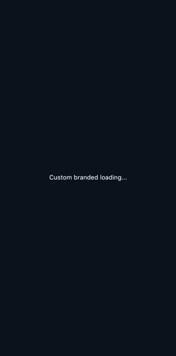

# DataStreamBuilder


A pragmatic `StreamBuilder` with sensible defaults.

## 😩 The problem with StreamBuilder

`StreamBuilder` is an essential tool to work with BLoCs or generally any stream.

But with enough streams in our codebase, a lot of boilerplate is introduced. Code gets repetitive and can't be easily reused:

```dart
StreamBuilder(
  stream: bloc.stock,
  builder: (context, AsyncSnapshot<Stock> snapshot) {
    if (snapshot.hasData) {
      return Text(snapshot.data.stock.toString());
    } else if (snapshot.hasError) {
      return Text(snapshot.error.toString());
    }
    return Center(child: CircularProgressIndicator());
  },
),
```

`DataStreamBuilder` aims to fix these issues for the common usecase:

```dart
DataStreamBuilder(
  stream: bloc.stock,
  builder: (context, Stock stock) => Text(stock.local.toString())
),
```

This library provides default builders for the loading and error states (can be supplied as `loadingBuilder` and `errorBuilder`), and only calls `builder` when data is present.

Depending on your current `StreamBuilder`s this could be a drop-in replacement. In any case, it's super easy to migrate to `DataStreamBuilder`.

*Note: if you need fine-grained control over `ConnectionState`s to the underlying computation, just use `StreamBuilder`.*

## 👩🏾‍💻 Usage

Using defaults for loading and error states:

```dart
DataStreamBuilder<List<Post>>(
  stream: Repository.of<Post>().findAll(),
  builder: (context, List<Post> posts) => ListView(
    children: posts.map((post) => ListTile(title: Text(post.body))).toList(),
  )
)
```

In case you are wondering, these are the defaults:

Default loading widget:

```dart
(context) => Center(child: CircularProgressIndicator());
```

Default error widget:

```dart
(context, dynamic error) {
  error = error is Exception ? error.toString() : 'Error: $error';
  return Center(child: Text(
      error,
      textDirection: TextDirection.ltr,
      style: TextStyle(backgroundColor: Colors.red, color: Colors.white),
    )
  );
};
```

Another example with custom loading and error widgets:

```dart
DataStreamBuilder<List<Post>>(
  stream: Repository.of<Post>().findAll(),
  loadingBuilder: (context) => Center(child: Text('Loading posts...')),
  errorBuilder: (context, error) => PostErrorView(error),
  builder: (context, List<Post> posts) => ListView(
    children: posts.map((post) => ListTile(title: Text(post.body))).toList(),
  )
)
```

Initial values can also be supplied:

```dart
// a stream that is a RxDart ValueObservable
final stream = Repository.of<Post>().findAll();

DataStreamBuilder<List<Post>>(
  stream: stream, // async access to stream
  initialValue: stream.value, // sync access to latest value
  builder: (context, List<Post> posts) => ListView(
    children: posts.map((post) => ListTile(title: Text(post.body))).toList(),
  )
)
```

See tests and the Example tab for a full example.

## 🛠 Extending

We can easily extend the class in order to provide our own app-wide defaults.

For instance, we could implement a branded loader:

```dart
class BrandedDataStreamBuilder<T> extends DataStreamBuilder<T> {

  static final brandedLoadingBuilder = (context) => Text('Custom branded loading...');

  BrandedDataStreamBuilder({
    Key key,
    @required Stream<T> stream,
    @required DataWidgetBuilder<T> builder,
    DataErrorWidgetBuilder errorBuilder
  }) :
    assert(builder != null),
    super(
      key: key,
      stream: stream,
      builder: builder,
      loadingBuilder: brandedLoadingBuilder,
      errorBuilder: errorBuilder
    );
}
```

In action:



## ➕ Collaborating

Please use Github to open issues and send PRs. Thanks 🙌

## 📝 License

MIT